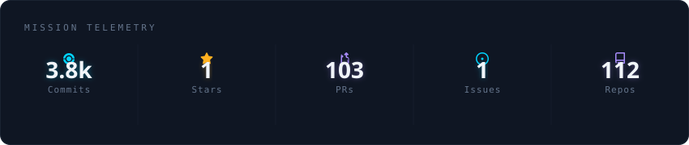

<!-- Galaxy Profile Banner SVGs (Auto-generated by python -m generator.main) -->
<div align="center">
  
</div>

<br/>

<div align="center">
  
</div>

<br/>

<div align="center">
  
</div>

<br/>

<div align="center">
  
</div>

<br/>

<!-- GitHub Streak Stats -->
<div align="center">
  <a href="#">
     
  </a>
</div>

<br/>

<!-- GitHub Activity Graph -->
<div align="center">
  <a href="#">
    
  </a>
</div>

<br/>

<!-- Snake Contribution Animation -->
<h2 align="center"> 
  Contribution Grid
</h2>

<table align="center">
  <tr>
    <td>
       <picture>
         <source media="(prefers-color-scheme: dark)" srcset="https://raw.githubusercontent.com/MD-Kayesur/MD-Kayesur/output/snake.svg">
         
       </picture>
    </td>
  </tr>
</table>

<br/>

<!-- Rainbow Divider -->
<div align="center">
  
</div>

<br/>

<details>
  <summary>
    <table align="center">
      <tr>
        <td>
            <strong>👇 Click to Expand My Profile 👇</strong>
        </td>
      </tr>
    </table>
  </summary>   

  <br/>

  <!-- Header with animated gradient and 3D effect -->
  <p align="center">
    <!-- Rainbow divider -->
    <a href="#"></a>
    <br/>
    <br/>
    <a href="#">
      
    </a>
  </p>

  <!-- Visitor counter with snake animation -->
  <p align="center">
    
    
  </p>

  <p align="center" style="font-size: 18px;">
    Full Stack Engineer with strong expertise in building scalable, production-ready web applications. Specialized in backend architecture, REST & GraphQL APIs, and database optimization.
  </p>

  <h2 align="center"> 
    Portfolio
  </h2>

  <p align="center">
    <a href="https://md-kayesur.web.app/" target="_blank">
      
    </a>
  </p>

  <p align="center">
    Explore my portfolio of scalable web applications, clean architectures, and modern solutions.
  </p>

  <h2 align="center"> 
    About Me
  </h2>

  ```yaml
  Current Role: Full Stack Engineer | Bangladesh
  Experience: 2+ Years in Full Stack Development
  Specialization: Javascript,Typescript, React.js, Next.js, Node.js, NestJS, MongoDB, PostgreSQL
  Education: Shyamnagar Government Mohsin Degree College
  Philosophy: Great software is built with clarity, scalability, and purpose
  ```

  <h2 align="center"> 
    Core Technologies
  </h2>

  <p align="center">
    
    
    
    
    
    
    
    
    
    
    
  </p>

  <a href="#">
    
  </a>

</details>
